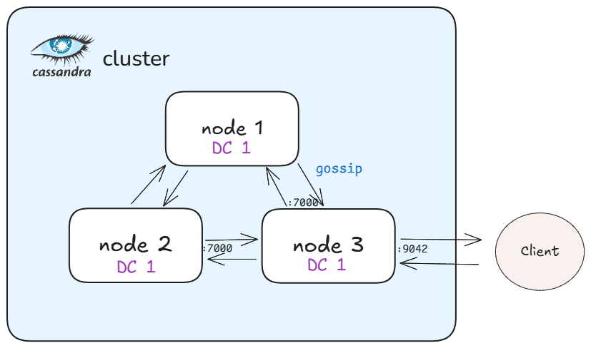
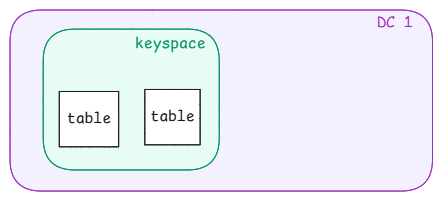

# Requêtes d'un système big data
Setup d'un cluster Cassandra de développement via docker. 
## Configuration
Apache Cassandra est une application Java (JDK doit donc être installé). 
Afin d'exécuter les requêtes par le langage CQLSH, Python est aussi nécessaire et est donc présent sur l'image par défaut.
## Connectivité 
Apache Cassandra utilise 3 ports :
<ul>
<li>7000 : port du protocole Gossip (communication inter-node)</li>
<li>7199 : port des métriques au format JMX de la JVM</li>
<li>9042 : écoute des requêtes au port 9042</li>
</ul>

 

## Structure 
Au niveau de l'organisation de la structure des données , on retrouve 3 concepts : 
<ul>
<li>Datacenter : Groupement de plusieurs noeuds repliquant la donnée des keyspace  </li>
<li>Keyspace : Equivalent au schema en SQL classique </li>
<li>Table : Comparative aux tables SQL classique</li>
</ul>

## Help
liens utiles: 
- https://medium.com/@kayvan.sol2/deploying-apache-cassandra-cluster-3-nodes-with-docker-compose-3634ef8345e8
- https://www.youtube.com/playlist?list=PLn6POgpklwWqNNhhGIJyArMm-rDeGoZs1
