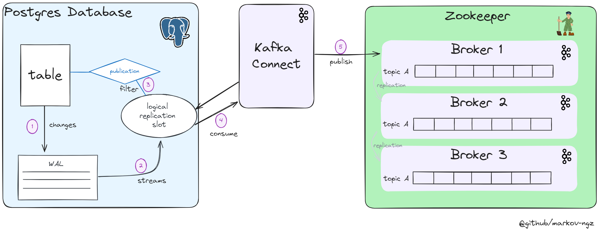

# Database Extraction
Performing Capture Data Change on a Postgres database.
## Executive Summary schema 


## Setup
1. A Postgres Database with the setting of the WAL level must be set to 'logical' (see folder 0-setup/postgres/cdc_db of the repository )
2. A Logical Replication slot must be created
3. A publication to capture change on a specific set of table must be created
4. A user must be granted access to the table and the publication
5. A kafka cluster must be up and running ( see 0-setup/kafka )

## Steps
1. Run the Kafka/Debezium Connect container
2. Check the connector state by running the script ```check.py``` 
3. Fake the database operations by running the script   ```simulate_traffic.py``` 
4. Check if the message are published to the topic, by executing to a broker's container and running : 
```
./bin/kafka-console-consumer.sh  --topic <topic_name> --bootstrap-server <bootstrap_server>:9092 --consumer-property group.id=<group_name>
```

## Documentation
- <b>debezium</b> : https://debezium.io/documentation/reference/stable/connectors/postgresql.html  <br>
- <b>postgres wal configuration </b> : https://www.postgresql.org/docs/12/runtime-config-wal.html

