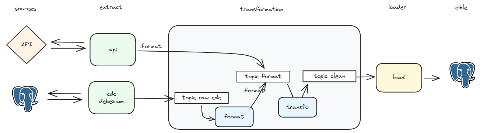

# Transformation de la donnée

## 1. Kafka

### Summary Schema : 

### 1.1 Format the data
The first step is to match the Debezium Kafka Connector messages to a generic format.
This is done in order to have the api published message and the message from this source to have the same format.
### 1.2 Transform 
Both sources ( API + Database ) have the same format, hence they are now transformed and aggregated by a set of specified rules (same as Big Data).
After being transformed the data is the published to a topic for the cleaned data.

