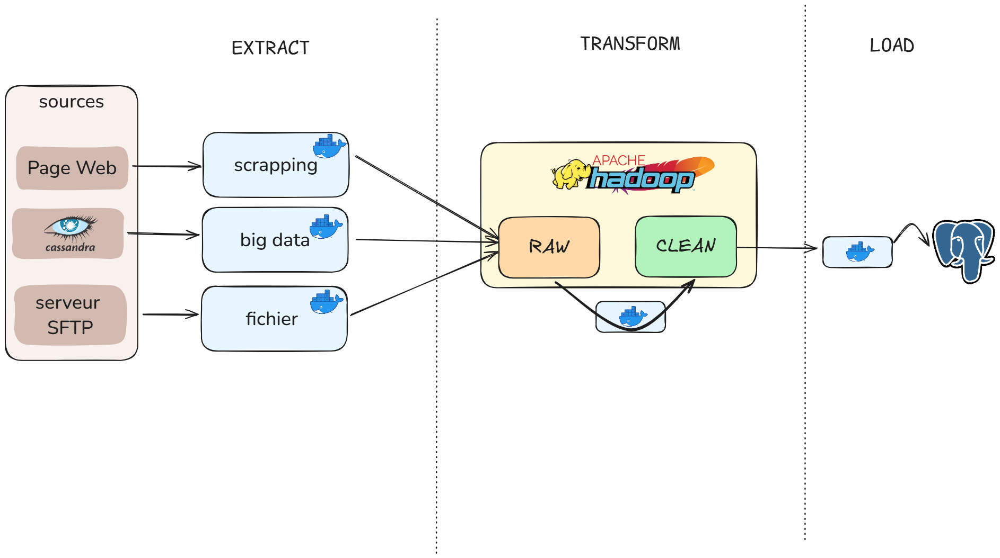

# Transformation de la donnée

## Agregation Rules 

Clean Typo 
- escape quotechar """ ( spécifique à la mise en .csv nécessaire à Hadoop )
- 3 char minimum len 

Generic 
- datasets columns names
- no null

Corrupted data 
-  10% length difference between 2 texts 

Duplicates are handled at loading ( even though it could be done at this step )

## 1. Kafka

### Summary Schema 


### 1.1 Format the data
The first step is to match the Debezium Kafka Connector messages to a generic format.
This is done in order to have the api published message and the message from this source to have the same format.
### 1.2 Transform 
Both sources ( API + Database ) have the same format, hence they are now transformed and aggregated by a set of specified rules (same as Big Data).
After being transformed the data is the published to a topic for the cleaned data.

## 2. Hadoop 

### Summary Schema 


### File Architecture
Each data source has a folder. </br>
To add a source to transform, the folder must be specified to an environment variable ```HDFS_SOURCES```. </br>
The output result will be added to the folder ```/translations/output``` .