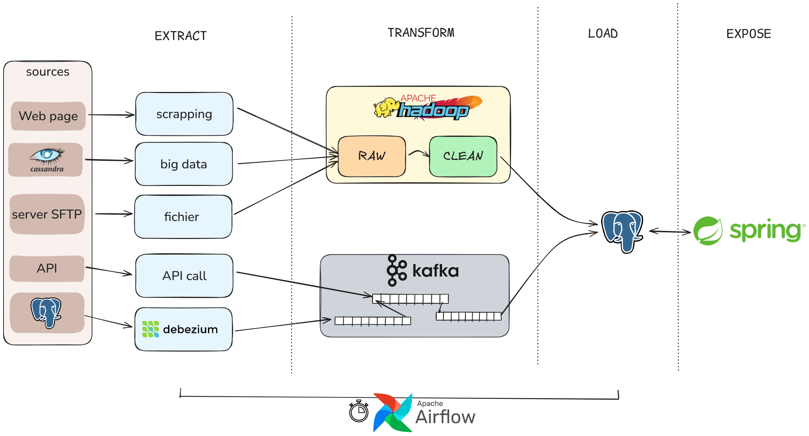
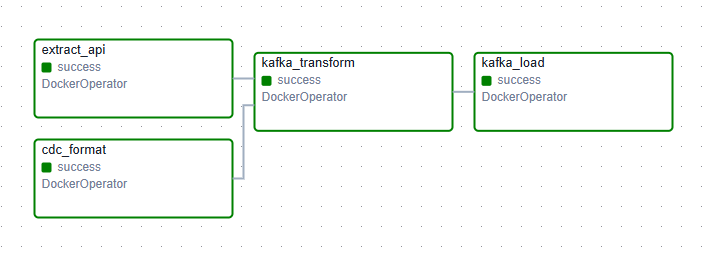
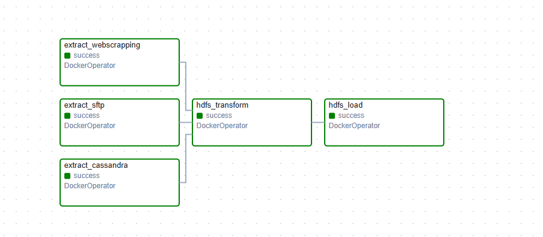

# DEVIA_BLOC_1_v2 
ETL pipeline
## Summary Schema 

## Explanation 
Why v2 ? An ugly 1st version is available here : https://github.com/markov-ngz/DEVIA_BLOC_1  . And still please not that this pipeline is not even "clean" as the purpose was to learn basic knowledge on Kafka/Hadoop/Airflow. 
## Apache Airflow DAGs
Apache Airflow is set up locally (via astro , see https://www.astronomer.io/docs/learn/get-started-with-airflow ).
The Docker provider is installed so that the scheduler can run docker container on host ( see "automation" folder on how to mount host docker socket to the scheduler container).
2 DAGs (Directed Acyclic Graph) are scheduled to run monthly :  
<b>Kafka DAG</b> 
 

 

<b>Hadoop DAG</b>  

 
## Cite and share
Please add the license to your work or add a star to the repository 😊 It would really help my career !

## Resources 
- Cassandra setup : https://medium.com/@kayvan.sol2/deploying-apache-cassandra-cluster-3-nodes-with-docker-compose-3634ef8345e8
- Spring security tutorial : https://gitlab.com/bastienapp/Briefs/-/tree/main/briefs/spring?ref_type=heads 
- Airflow introduction : https://www.youtube.com/@MarcLamberti/videos  
- Ansible/Kafka/Docker introduction : https://www.youtube.com/@xavki/videos 
- WAL configuration : https://www.postgresql.org/docs/14/wal-intro.html 

